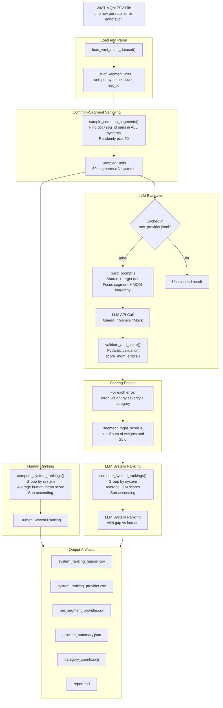

```mermaid
flowchart TD
    TSV["WMT MQM TSV File\none row per rater-error annotation"]

    subgraph LOAD["Load and Parse"]
        PARSE["load_wmt_mqm_dataset()"]
        UNITS["List of SegmentUnits\none per system x doc x seg_id"]
        PARSE --> UNITS
    end

    subgraph SAMPLE["Common-Segment Sampling"]
        COMMON["sample_common_segments()\nFind doc+seg_id pairs in ALL systems\nRandomly pick 50"]
        SAMPLED["Sampled Units\n50 segments x N systems"]
        COMMON --> SAMPLED
    end

    subgraph HUMAN_RANK["Human Ranking"]
        HRANK["compute_system_rankings()\nGroup by system\nAverage human mean score\nSort ascending"]
        HOUT["Human System Ranking"]
        HRANK --> HOUT
    end

    subgraph LLM_EVAL["LLM Evaluation"]
        CACHE{"Cached in\nraw_provider.jsonl?"}
        PROMPT["build_prompt()\nSource + target doc\nFocus segment + MQM hierarchy"]
        API["LLM API Call\nOpenAI / Gemini / Mock"]
        VALIDATE["validate_and_score()\nPydantic validation\nscore_mqm_errors()"]
        SKIP["Use cached result"]
        CACHE -->|miss| PROMPT
        PROMPT --> API
        API --> VALIDATE
        CACHE -->|hit| SKIP
    end

    subgraph SCORE["Scoring Engine"]
        ERRORS["For each error:\nerror_weight by severity + category"]
        SUM["segment_mqm_score =\nmin of sum of weights and 25.0"]
        ERRORS --> SUM
    end

    subgraph LLM_RANK["LLM System Ranking"]
        LRANK["compute_system_rankings()\nGroup by system\nAverage LLM scores\nSort ascending"]
        LOUT["LLM System Ranking\nwith gap vs human"]
        LRANK --> LOUT
    end

    subgraph OUTPUT["Output Artifacts"]
        CSV1["system_ranking_human.csv"]
        CSV2["system_ranking_provider.csv"]
        CSV3["per_segment_provider.csv"]
        JSON1["provider_summary.json"]
        SVG1["category_counts.svg"]
        MD["report.md"]
    end

    TSV --> PARSE
    UNITS --> COMMON
    SAMPLED --> HRANK
    SAMPLED --> CACHE
    VALIDATE --> SCORE
    SUM --> LLM_RANK
    HOUT --> OUTPUT
    LOUT --> OUTPUT
```